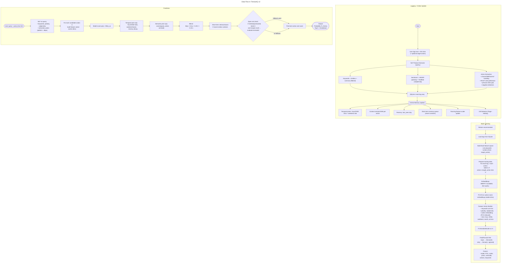

# 🔱 TiresiasIQ v3

The given flow depicts the pathway of data through the model


## Quick Start

As of v2.1, individual GUI support for different OSes have been removed. Only the web dashboard support is available since it is lightweight,portable and offline too.

### Prerequisites
- Python 3.9+ (Python 3.11 is recommended)
- pip package manager

### Installation
1. Make a venv:
```python
python3.11 -m venv ~/tiq-env
source ~/tiq-env/bin/activate
pip install --upgrade pip
```
replace 'python3.11' with your installed python version or 'python' if that is your default compiler and is >3.9

2. Install dependencies: `pip install -r requirements.txt`

3. Install spaCy English model: `python -m spacy download en_core_web_md`

4. Run the Streamlit web app: 
   - **Option 1**: `python run.py` (recommended)
   - **Option 2**: `streamlit run app.py`

> [!NOTE]
> If you don't have pip, just run the `get-pip.py` file and then install the requirements

## Web Dashboard Features

The Streamlit web dashboard provides:
- **Logger Window**: Log your feelings, actions, and emotions with automatic keyword extraction
- **Model Training**: Train the prediction model with your logged data (KNN + FFN)
- **Prediction Window**: Ask natural language questions about future behaviors
- **Database Viewer**: View and manage all your logged entries

---

# TiresiasIQ Predictor v3 — Feature Summary

TiresiasIQ v3 is an **adaptive hybrid predictive model** that combines ML predictions, temporal priors, semantic embeddings, and short-term memory for context-aware action prediction.

## Key Features

### 1. Hybrid Prediction
- Blends three sources of information:
  - **Model probability** (`w_model`)
  - **Temporal priors** (`w_temporal`): hour, day-of-week, weekend effects, and recency
  - **Semantic similarity** (`w_semantic`): cosine similarity with past context
- Configurable blending weights for fine-grained control.

### 2. Online Learning & Adaptation
- `update_with_log(...)` allows **incremental updates** without full retraining.
- Updates per-action **priors**, **context centroids**, and **short-term memory**.
- Maintains **per-user memory** for personalized predictions.

### 3. Short-Term Retrieval
- Maintains a **recent log memory** (configurable size).
- Boosts candidate actions based on **semantic similarity** and **temporal proximity**.

### 4. Drift Detection
- **Page-Hinkley style detector** per action to flag potential data drift.
- Allows external retraining triggers when user behavior changes.

### 5. Action Normalization & Extraction
- Extracts **core verbs** from text, handles **negation** and **particles**.
- Ensures consistent action representation across logs.
- `summarize_action_context(action)` provides human-readable summaries.

### 6. Feature Space
- Combines:
  - Keyword presence (fixed `all_keywords`)
  - Polarity & subjectivity
  - PCA-reduced action embeddings
  - Time features (hour, day, month, weekend, cyclical sin/cos)
- Supports **sentence-transformers** or **spaCy** embeddings.

### 7. Compatibility & Robustness
- Backwards-compatible API:
  - `update_running_status(data)` → batch training
  - `predict(query, pred_time, user_id=None)` → predicts next action
  - `update_with_log(log_row, user_id=None)` → online update
- Fallback mechanisms if embeddings or models are unavailable.
- Lightweight, dependency-minimized drift detection.

---

**Summary:**  
TiresiasIQ v3 combines **ML, temporal reasoning, semantic embeddings, and short-term episodic memory** to deliver **adaptive, context- and time-aware action prediction** with incremental learning and drift detection.

---

## Troubleshooting

### Common Issues

```bash
ImportError: DLL load failed while importing _pywrap_tensorflow_internal:
A dynamic link library (DLL) initialization routine failed.
```

| Cause                                      | Explanation                                                                                     |
|-------------------------------------------|-------------------------------------------------------------------------------------------------|
| **Missing Visual C++ Redistributables** | TensorFlow needs specific low-level system DLLs (`MSVCP140.dll`, etc.) from Microsoft. Download the [latest version](https://learn.microsoft.com/en-us/cpp/windows/latest-supported-vc-redist) of C++ and also VC++ from [here](https://aka.ms/vs/17/release/vc_redist.x64.exe)       |
| **Incompatible TensorFlow version**     | If you mix TensorFlow versions with Python versions it doesn't support, it breaks like this.    |
| **GPU-related issues** (if applicable)  | Installing `tensorflow-cpu`, sometimes the DLLs still call GPU-related imports. So install the lightweight cpu version  |
| **Windows blocks DLL loading**          | Sometimes SmartScreen/Antivirus blocks DLL initialization silently.                             |

## Project Structure

- `app.py` - Main Streamlit web application
- `predictor.py` - Core prediction engine with NLP and ML capabilities
- `behavior.db` - SQLite database for storing user logs and training data
- `requirements.txt` - Python dependencies
- `run.py` - Simple startup script for the Streamlit app

---

## License

This project is licensed under the TiresiasIQ Personal Use License (T-PUL) v1.0.  
See [LICENSE.txt](https://github.com/axelvyrn/TiresiasIQ?tab=License-1-ov-file) for full terms.  
**Use it, don't abuse it.**
