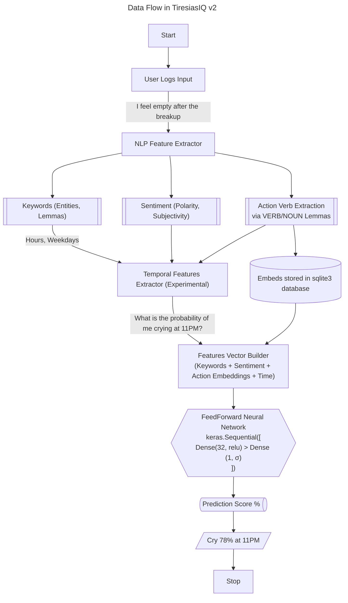

# 🔱 TiresiasIQ v2

The given flow depicts the pathway of data through the model


## Quick Start

**Recommended:** Use the web app that can be run without any errors through `python -m streamlit run app.py` after installing the necessary dependencies.

### Prerequisites
- Python 3.9+ (Python 3.11 is recommended)
- pip package manager

### Installation
1. Make a venv:
```python
python3.11 -m venv ~/tiq-env
source ~/tiq-env/bin/activate
pip install --upgrade pip
```
replace 'python3.11' with your installed python version or 'python' if that is your default compiler and is >3.9

2. Install dependencies: `pip install -r requirements.txt`

3. Install spaCy English model: `python -m spacy download en_core_web_sm`

4. Run the Streamlit web app: 
   - **Option 1**: `python run.py` (recommended)
   - **Option 2**: `python -m streamlit run app.py`

> [!NOTE]
> If you don't have pip, just run the `get-pip.py` file and then install the requirements

## Web Dashboard Features

The Streamlit web dashboard provides:
- **Logger Window**: Log your feelings, actions, and emotions with automatic keyword extraction
- **Model Training**: Train the prediction model with your logged data
- **Prediction Window**: Ask natural language questions about future behaviors
- **Database Viewer**: View and manage all your logged entries

## Troubleshooting

### Common Issues

```bash
ImportError: DLL load failed while importing _pywrap_tensorflow_internal:
A dynamic link library (DLL) initialization routine failed.
```

| Cause                                      | Explanation                                                                                     |
|-------------------------------------------|-------------------------------------------------------------------------------------------------|
| **Missing Visual C++ Redistributables** | TensorFlow needs specific low-level system DLLs (`MSVCP140.dll`, etc.) from Microsoft. Download the [latest version](https://learn.microsoft.com/en-us/cpp/windows/latest-supported-vc-redist) of C++ and also VC++ from [here](https://aka.ms/vs/17/release/vc_redist.x64.exe)       |
| **Incompatible TensorFlow version**     | If you mix TensorFlow versions with Python versions it doesn't support, it breaks like this.    |
| **GPU-related issues** (if applicable)  | Installing `tensorflow-cpu`, sometimes the DLLs still call GPU-related imports. So install the lightweight cpu version  |
| **Windows blocks DLL loading**          | Sometimes SmartScreen/Antivirus blocks DLL initialization silently.                             |

## Project Structure

- `app.py` - Main Streamlit web application
- `predictor.py` - Core prediction engine with NLP and ML capabilities
- `behavior.db` - SQLite database for storing user logs and training data
- `requirements.txt` - Python dependencies
- `run.py` - Simple startup script for the Streamlit app

## License

This project is licensed under the TiresiasIQ Personal Use License (T-PUL) v1.0.  
See [LICENSE.txt](https://github.com/axelvyrn/TiresiasIQ?tab=License-1-ov-file) for full terms.  
**Use it, don't abuse it.**
