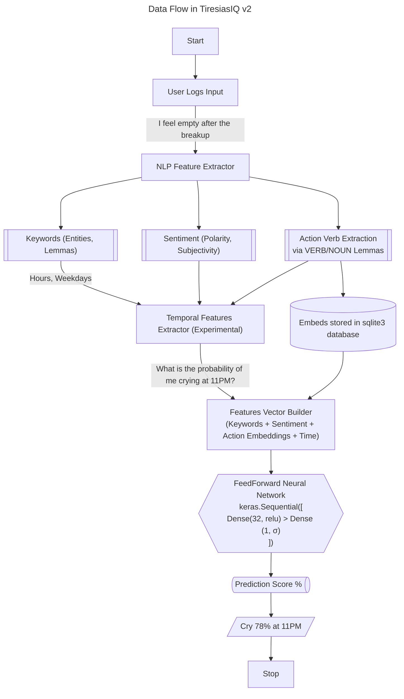

# 🔱 TiresiasIQ v2

The given flow depicts the pathway of data through the model


Stable releases can be found in Releases section.
    
**Recommended:** Use the web app that can be run without any errors through `python -m streamlit run app.py` after installing the necessary dependencies (Python 3.13 is required) which are which can be installed through 
1. `pip install -r requirements.txt`

> [!NOTE]
> If you don't have pip, just run the `get-pip.py` file and then install

2. Install spaCy English model through: `python -m spacy download en_core_web_sm`
3. Run streamlit web app `pythom -m streamlit run app.py`

## Walkthrough for Windows GUI
If you are using the GUI for Windows, the interface will look as shown below


You need Python 3.10+ (but not 3.12 as it does not support tensorflow)
TensorFlow 2.12 is the last version officially supporting Python 3.11 on Windows.

Just run `setup.bat`, it will show any necessary logs/errors and will install the required dependencies as well as start the Predictor Environment
> [!IMPORTANT]
> The first setup may take 10+ minutes if everything works smoothly

## Troubleshooting:

```bash
   ImportError: DLL load failed while importing _pywrap_tensorflow_internal:
   A dynamic link library (DLL) initialization routine failed.
```

| Cause                                      | Explanation                                                                                     |
|-------------------------------------------|-------------------------------------------------------------------------------------------------|
| **Missing Visual C++ Redistributables** | TensorFlow needs specific low-level system DLLs (`MSVCP140.dll`, etc.) from Microsoft. Download the [latest version](https://learn.microsoft.com/en-us/cpp/windows/latest-supported-vc-redist) of C++ and also VC++ from [here](https://aka.ms/vs/17/release/vc_redist.x64.exe)       |
| **Incompatible TensorFlow version**     | If you mix TensorFlow versions with Python versions it doesn't support, it breaks like this.    |
| **GPU-related issues** (if applicable)  | Installing `tensorflow-cpu`, sometimes the DLLs still call GPU-related imports. So install the lightweight cpu version  |
| **Windows blocks DLL loading**          | Sometimes SmartScreen/Antivirus blocks DLL initialization silently.                             |

> [!WARNING]
> Always remember your username, it is like your password to access your specific db, different usernames will create different dbs.

## License

This project is licensed under the TiresiasIQ Personal Use License (T-PUL) v1.0.  
See [LICENSE.txt](https://github.com/axelvyrn/TiresiasIQ?tab=License-1-ov-file) for full terms.  
**Use it, don't abuse it.**
